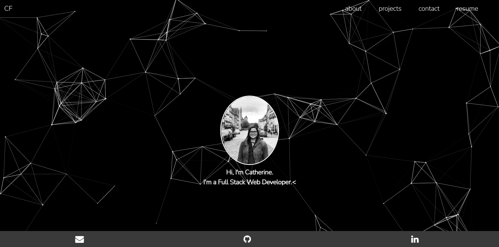

# react-portfolio

## Description

This is my personal portfolio built using React. Take a look at my projects, learn a bit about me, and find the different methods of reaching out to me.

## Table of Contents

- [Usage](#usage)
- [Contributing](#contributing)
- [Questions](#questions)

## Usage

[Link to my portfolio repository](https://github.com/cdfoye/react-portfolio)

[Link to the deployed site](https://cdfoye.github.io/react-portfolio/)

See below for a peak at what my portfolio looks like:

## Contributing

If you would like to contribute to making improvements please reach out to me on Github or by email.

## Questions

If you have any questions please visit my Github profile: [cdfoye](https://github.com/cdfoye)

For additional questions you can email me at cdfoye@gmail.com
